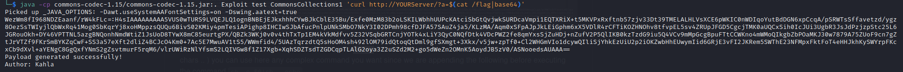

icon:fontawesome/solid/unlock-keyhole

# CVE-2021-27850

CVE-2021-27850 - Apache Tapestry

CVE-2021-27850 is a critical unauthenticated remote code execution vulnerability that was found in all recent versions of Apache Tapestry, by downloading the AppModule.class file we can leak the HMAC Secret key used to sign all the serialized objects in apache Tapestry.

## Installation

```bash
git clone https://github.com/kahla-sec/CVE-2021-27850_POC.git
```

```bash
javac -classpath commons-codec-1.15/commons-codec-1.15.jar:. Exploit.java
```

## Usage

```bash
java -cp commons-codec-1.15/commons-codec-1.15.jar:. Exploit [Tapestry Key] [Ysoserial Payload] [Command To Execute]
```

Where [Tapestry Key] is the Hmac key leaked from the AppModule.class , [Ysoserial Payload] is the payload you want to use from ysoserial and [Command To Execute] the command you want to execute.



Note: Unlike the usual Java deserialization exploits where the commands you run are limited ( no pipes or special chars .. ) you can use here any complex command you want since we are appending the following before executing the command **sh -c $@|sh . echo**.

## References

- [Cve.mitre.org - 2021-27850](http://cve.mitre.org/cgi-bin/cvename.cgi?name=2021-27850)
- [Github.com - Apache - Tapestry-5](https://github.com/apache/tapestry-5)
