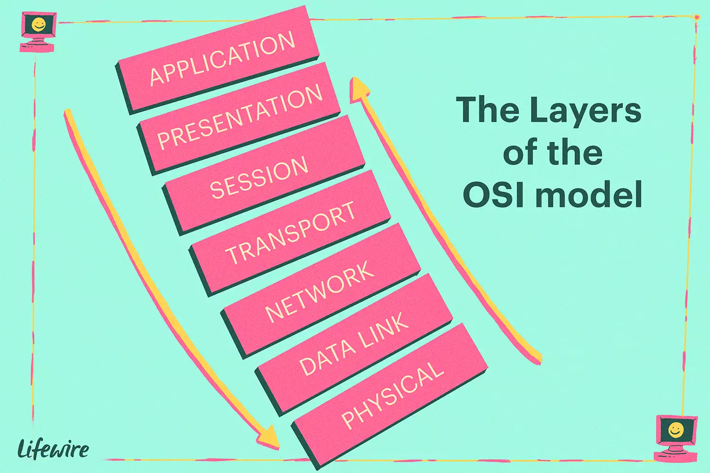

The OSI model is a seven-layer model used to visualize computer networks. Each of the seven layers goes up in increments of one as it gets closer to the human layer ([Application Layer](application.md)). The bottom layer ([Physical Layer](physical.md)) is where the network receives and transmits raw data.

The OSI model belongs to the International Organization for Standards (ISO) and is maintained by the Identification ISO/IEC 7498-1.

The seven layers are as follows:

- [Application Layer](application.md)
- [Presentation Layer](presentation.md)
- [Session Layer](session.md)
- [Transport Layer](transport.md)
- [Network Layer](network.md)
- [Data Link Layer](datalink.md)
- [Physical Layer](physical.md)