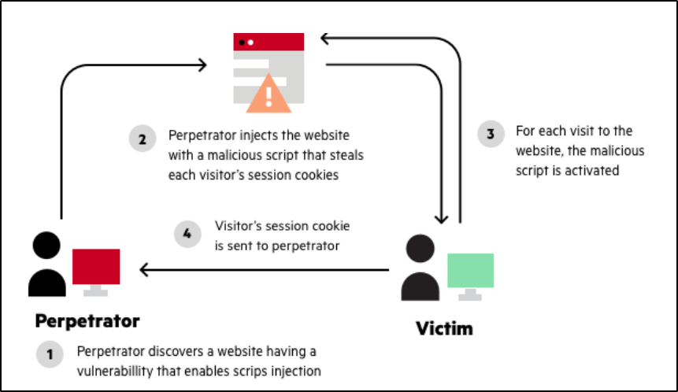

Reflected XSS attacks, also known as non-persistent attacks, occur when a malicious script is reflected off of a web application to the victim’s browser.

The script is activated through a link, which sends a request to a website with a vulnerability that enables execution of malicious scripts. The vulnerability is typically a result of incoming requests not being sufficiently sanitized, which allows for the manipulation of a web application’s functions and the activation of malicious scripts.

To distribute the malicious link, a perpetrator typically embeds it into an email or third party website (e.g., in a comment section or in social media). The link is embedded inside an anchor text that provokes the user to click on it, which initiates the [Cross-Site Scripting|XSS]() request to an exploited website, reflecting the attack back to the user.

Unlike a [Stored XSS|stored]() attack, where the perpetrator must locate a website that allows for permanent injection of malicious scripts, reflected attacks only require that the malicious script be embedded into a link. That being said, in order for the attack to be successful, the user needs to click on the infected link.

As such, there are a number of key differences between reflected and stored XSS attacks, including:

- Reflected attacks are more common.
- Reflected attacks do not have the same reach as stored XSS attacks.
- Reflected attacks can be avoided by vigilant users.

With a reflected XSS, the perpetrator plays a “numbers game” by sending the malicious link to as many users as possible, thereby improving his odds of successfully executing the attack.

