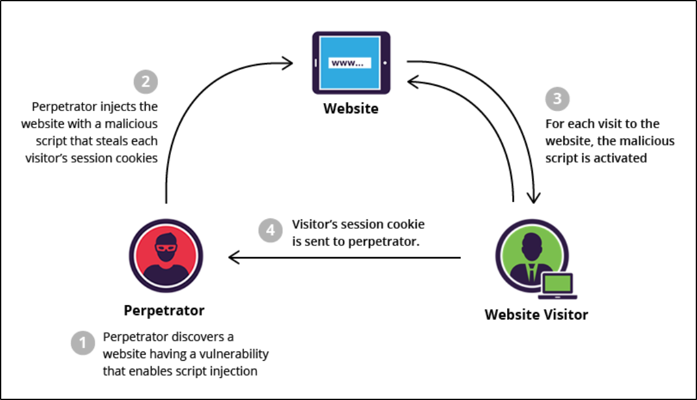

In a Stored XSS attack, the vulnerable web application receives user-supplied input from untrusted sources and stores it. This malicious content also gets included in the later HTTP responses sent by the server.

To perform a Stored XSS attack, hackers only need to identify a security vulnerability within the backend application that allows executing malicious requests. This makes it more exploitable as hackers do not need to craft external methods for supplying untrusted inputs to the target application server.

Stored XSS attacks typically rely on unsanitized user input points for scripts permanently stored on the target servers. Since these attacks allow malicious users to control how the browser executes a script, they can typically facilitate a complete user account takeover.

The impact of a successful attack ranges from mild to full-blown compromise depending on the privileges assigned to the valid affected user.

To successfully execute a stored XSS attack, a perpetrator has to locate a vulnerability in a web app and then inject malicious script into its server (e.g. via a comment field):

>[!info]
>The most frequent targets are websites that allow users to share content, including blogs, social networks, video sharing platforms and message boards. Every time the infected page is viewed, the malicious script is transmitted to the victim’s browser.