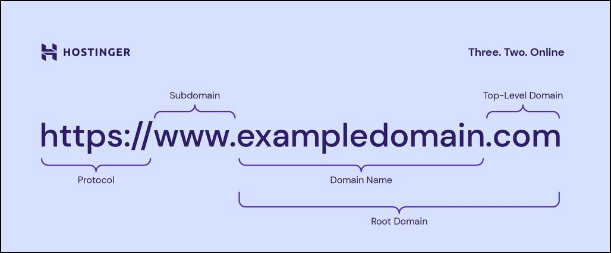

A FQDN is simply part of the [[Uniform Resource Locator|URL]]. It is the full name of an entity on the Internet, including a host and a computer. It simply specifies all domain levels written in the "hostname.domain.tld" format. As an example, a mail server of Yahoo might be "mail.yahoo.com"/

There are elements on an FQDN hierarchy which is as follows:

- [[Hostname]] - label assigned to a server service available on a network. DNS server uses a hostname to make an IP address easy to remember. Examples include "www" or "en" 
- [[Subdomains|Subdomain]] - left side of a second-level domain and indicates a section of a larger domain. For example "support.complexsecurity.io" is a part of complexsecurity.io and the word "support" is the subdomains.
- Domain name - consists of a second-level and a [[Top-Level Domain (TLD)|top-level domain]]. For example, in "complexsecurity.io", "complexsecurity" is the second-level domain and ".io" is the top-level domain.