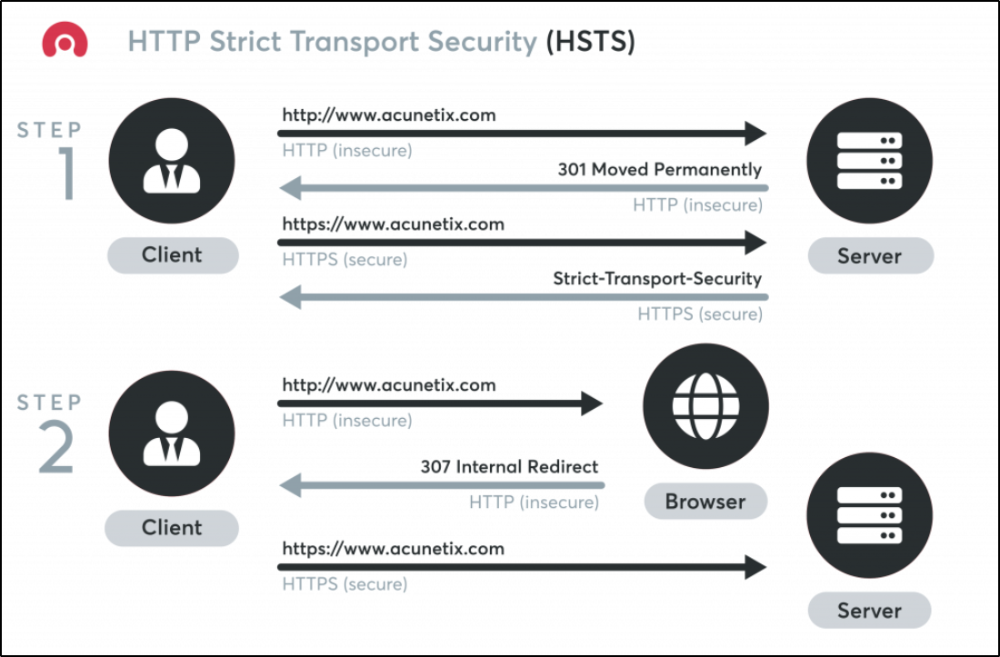

HSTS stands for **HTTP Strict Transport Security**. It is a method used by websites to declare that they should only be accessed using a secure connection ([[HTTPS Protocol|HTTPS]]). 

If a website declares an HSTS policy, the browser must refuse all [[HTTP Protocol|HTTP]] connections and prevent users from accepting insecure [[SSL certificates]]. HSTS is currently supported by most major browsers (only some mobile browsers fail to use it.

Typically, when you enter a URL in the web browser, you skip the protocol part. For example, you type www\.acunetix\.com, not http\://www\.acunetix\.com. 

In such a case, the browser assumes that you want to use the HTTP protocol so it makes an HTTP request to www.acunetix.com.

At this stage, the web server replies with a redirect (301 response code) that points to the HTTPS site. The browser makes an HTTPS connection to www\.acunetix\.com. This is when the HSTS security policy protection begins using an HTTP response header:

```bash
Strict-Transport-Security: max-age=31536000; includeSubDomains; preload
```

The **Strict-Transport-Security** header gives specific instructions to the browser. From now on, every connection to the site and its subdomains for the next year (31536000 seconds) from the moment this header is received must be an HTTPS connection. 

HTTP connections are not allowed at all. If the browser receives a request to load a resource using HTTP, it must try an HTTPS request instead. If HTTPS is not available, the connection must be terminated.

Additionally, if the certificate is not valid, you will be prevented from making a connection. Usually, if a certificate is not valid (expired, self-signed, signed by an unknown CA, etc.) the browser displays a warning that you can circumvent. 

However, if the site has HSTS, the browser will not let you circumvent the warning at all. To access the site, you must remove the site from the HSTS list within the browser.

The Strict-Transport-Security header is sent for a given website and covers a particular domain name. Therefore, if you have the HSTS header for www\.acunetix\.com, it will not cover acunetix.com but only the www subdomain.

This is why, for complete protection, your website should include a call to the base domain (in this case, acunetix.com) and receive a Strict-Transport-Security header for that domain with the includeSubDomains directive.



