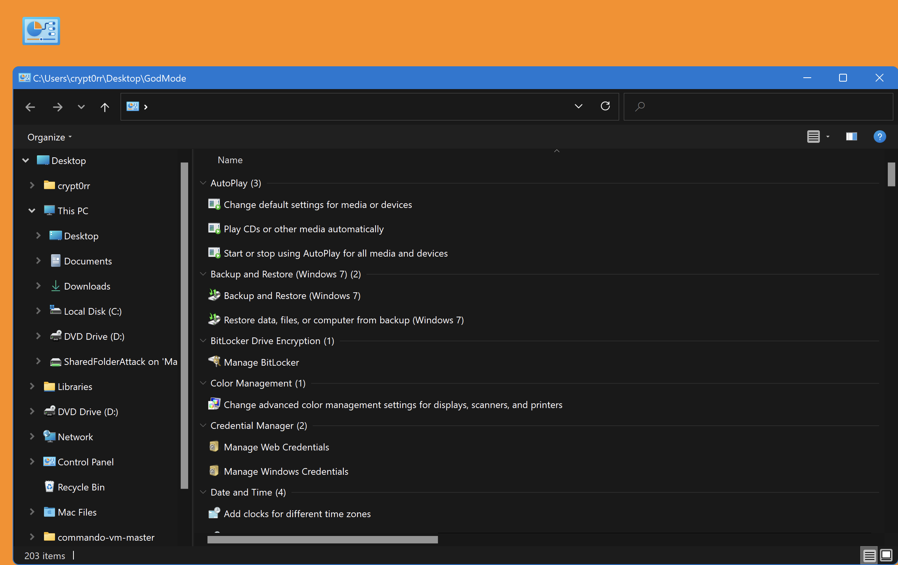

icon:simple/windows10

# GodMode

GodMode is a hidden feature in Windows that provides access to various system settings and administrative tools through a single folder-like interface.

## Usage

Create a folder on for example Desktop with the name below:

```powershell
GodMode.{ED7BA470-8E54-465E-825C-99712043E01C}
```



## References

- [Lifewire.com - GodMode Windows](https://www.lifewire.com/god-mode-windows-4154662)
- [HowToGeek.com - Enable GodMode in Windows 10](https://www.howtogeek.com/402458/enable-god-mode-in-windows-10/)
